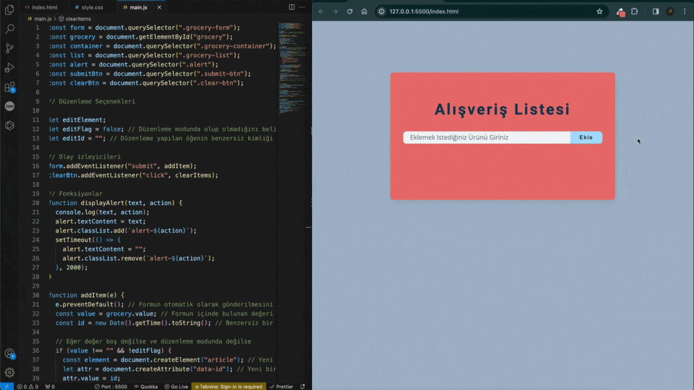

## Alışveriş Listesi Uygulamsı

Bu basit grocery list uygulaması, kullanıcıların alışveriş listelerini yönetmelerine olanak tanıyan bir web uygulamasıdır. Kullanıcılar, yeni öğeler ekleyebilir, mevcut öğeleri düzenleyebilir, silebilir ve tüm listeyi temizleyebilirler.

# Kullanım
Uygulamayı kullanmak için aşağıdaki adımları takip edebilirsiniz:

Sayfadaki form aracılığıyla alışveriş listesine yeni öğeler ekleyin.
Eklediğiniz öğeleri düzenlemek için "Düzenle" butonuna tıklayın.
Silmek istediğiniz öğeleri "Sil" butonu aracılığıyla silebilirsiniz.
Tüm alışveriş listesini temizlemek için "Tümünü Temizle" butonuna tıklayın.

# Özellikler
Yeni öğe ekleme
Öğeleri düzenleme
Öğeleri silme
Tüm listeyi temizleme

# Teknik Detaylar
Uygulama, HTML, CSS ve JavaScript kullanılarak geliştirilmiştir. Temel olarak şu özelliklere dayanmaktadır:

addItem: Forma öğe eklerken çağrılan fonksiyon. Boş bir değer eklenmez ve düzenleme modunda değilse yeni bir öğe oluşturur.

deleteItem: Öğeyi silen fonksiyon. Silinen öğe için bir uyarı gösterir.

clearItems: Tüm öğeleri temizleyen fonksiyon. Kullanıcıya liste boş ise bir uyarı gösterir.

editItem: Öğeyi düzenleme moduna geçiren fonksiyon. Düzenlenen öğenin değerini alır ve "Düzenle" butonuna tıklandığında günceller.

displayAlert: Kullanıcıya çeşitli durumları bildiren fonksiyon. Başarı, hata vb. durumları gösterir.

# Katkıda Bulunma
Eğer bu uygulama üzerinde herhangi bir geliştirme yapmak istiyorsanız, lütfen forklayın ve pull request gönderin. Katkılarınızı memnuniyetle karşılarız!

# gif
#
# todo_list
# todo_list.
# todo_list.
